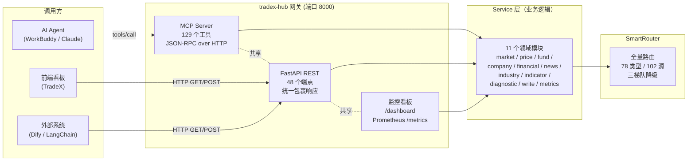
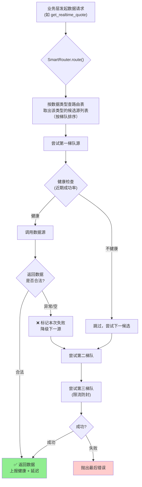

<div align="center">

# tradex-hub

**AI 金融智能决策中台**

为 AI Agent 提供统一的 **A 股数据 + 量化计算 + 决策支持** 接口

</div>

<p align="center">
  
  
  
  
  
  
  
</p>

---

## 项目介绍

tradex-hub 是一个**本地运行的金融数据中台**，把分散在多个数据源（通达信、腾讯财经、东方财富、同花顺、新浪、巨潮、财联社、AKShare 等）的 A 股数据，统一封装成 **129 个 MCP 工具** + **48 个 REST 端点**，供 AI Agent（WorkBuddy / Claude Code / Cursor / Dify / LangChain）和前端看板（TradeX）一站式调用。

**核心定位**：让 AI Agent **不用关心数据从哪儿来、怎么反爬、怎么降级** —— 只管调一个统一接口，tradex-hub 自动选最优数据源、自动健康检查、自动故障隔离。

### 核心能力

| 能力 | 说明 |
|------|------|
| **统一接入** | 一套接口同时服务 MCP 客户端（AI Agent）和 HTTP 客户端（看板/前端），共享同一业务逻辑层 |
| **多源融合** | 78 个数据类型，102 个数据源实例，按封禁风险分三梯队，自动降级 |
| **量化计算** | 技术指标（MACD/KDJ/RSI/BOLL）、绩效指标、多因子分析、条件选股 |
| **决策支持** | 交易信号生成、综合诊断（个股/市场/技术）、龙虎榜、涨停揭秘 |
| **实时盯盘** | eltdx 通达信协议常驻连接，五档盘口准实时推送 |
| **可观测性** | Prometheus 指标、监控看板、数据源健康表、端点 P95 性能、慢查询日志 |
| **接入友好** | 三层令牌桶限流 + 访问日志双写 + TypeScript / Python 双语言 SDK |

### 三层能力模型

```
┌────────────────────────────────────────────────────────────────┐
│  外部调用方                                                     │
│  ┌────────────────┐  ┌────────────────┐  ┌────────────────┐    │
│  │ MCP 客户端     │  │ REST 客户端    │  │ 浏览器看板     │    │
│  │ (AI Agent)     │  │ (前端/外部)    │  │ (/dashboard)   │    │
│  └────────┬───────┘  └────────┬───────┘  └────────┬───────┘    │
│           │                   │                   │             │
└───────────┼───────────────────┼───────────────────┼─────────────┘
            │                   │                   │
            ▼                   ▼                   ▼
┌────────────────────────────────────────────────────────────────┐
│  协议层（双协议并存）                                            │
│  ┌─────────────────────┐    ┌─────────────────────────────┐    │
│  │  MCP Server         │    │  FastAPI REST               │    │
│  │  129 个工具         │    │  48 个端点（/api/v1/*）      │    │
│  └──────────┬──────────┘    └──────────────┬──────────────┘    │
│             │                              │                    │
│             └──────────┬───────────────────┘                    │
│                        ▼                                        │
└────────────────────────┼────────────────────────────────────────┘
                         │
                         ▼
┌────────────────────────────────────────────────────────────────┐
│  Service 层（共享业务逻辑）                                      │
│  ┌──────┬──────┬──────┬──────┬──────┬──────┬──────┬──────┐     │
│  │market│price │fund  │compny│financ│news  │indstr│write │     │
│  └──┬───└──┬───└──┬───└──┬───└──┬───└──┬───└──┬───└──┬───┘     │
│     └──────┴──────┴──────┴──────┴──────┴──────┴──────┘         │
│                        │                                        │
└────────────────────────┼────────────────────────────────────────┘
                         ▼
┌────────────────────────────────────────────────────────────────┐
│  SmartRouter 全量路由层                                          │
│  ┌────────────────────────────────────────────────────────┐    │
│  │  对每个数据类型按梯队选最优源、健康评分、自动降级        │    │
│  └────────────────────────────────────────────────────────┘    │
│                                                                 │
│  数据源梯队                                                     │
│  ┌───────────────┐  ┌───────────────┐  ┌───────────────┐       │
│  │ 第一梯队      │  │ 第二梯队      │  │ 第三梯队      │       │
│  │ (不封 IP)     │  │ (低风险)      │  │ (限流防封)    │       │
│  │ eltdx / 腾讯  │  │ 同花顺 / 新浪 │  │ 东财 push2    │       │
│  │ 本地 vipdoc   │  │ 巨潮 / 财联社 │  │ push2ex       │       │
│  └───────────────┘  └───────────────┘  └───────────────┘       │
└────────────────────────────────────────────────────────────────┘
```

---

## 双协议并存架构

tradex-hub 同时暴露两个协议接口，**共享同一套业务逻辑**，调用方按需选择：



| 协议 | 适用场景 | 接口形态 |
|------|----------|----------|
| **MCP** | AI Agent 对话式调用（工具描述可被 LLM 理解） | JSON-RPC over HTTP，129 个工具 |
| **REST** | 看板 / 外部系统 / 自定义脚本 | 标准 HTTP + JSON，48 端点，包裹响应 `{code, data, msg}` |

两个协议返回的数据**完全一致**（仅序列化差异：MCP 返 JSON 字符串、REST 返包裹 dict），契约严格对齐。

---

## SmartRouter 全量路由原理

SmartRouter 是 tradex-hub 的核心 —— 它让上层无需关心数据从哪个源来：



**梯队划分**（按封禁风险从低到高）：

| 梯队 | 数据源 | 特征 |
|------|--------|------|
| **第一梯队** | eltdx（通达信协议） / 腾讯财经 HTTP / 本地 vipdoc | 不封 IP，可高频调用 |
| **第二梯队** | 同花顺 / 新浪 / 巨潮 / 财联社 | 低风险，正常调用即可 |
| **第三梯队** | 东财 push2 / push2ex / slist | 高封禁风险，仅用于独有数据，自动限流（间隔 ≥1s + 随机抖动） |

---

## 安装

### 环境要求

- Python 3.13+
- 网络可访问国内 A 股数据源（eltdx 协议、HTTP 接口；代理仅给 GitHub 用，国内数据源必须直连）

### 快速开始

```bash
git clone https://github.com/wolfjkd/tradex-hub.git
cd tradex-hub

# 创建虚拟环境
python -m venv .venv
.venv\Scripts\activate    # Windows
# source .venv/bin/activate  # Linux/macOS

# 安装依赖
pip install -r tradex/src/requirements.txt

# 启动网关（HTTP 模式，默认 8000 端口）
python -m tradex --http
```

启动后访问：
- 监控看板：http://127.0.0.1:8000/dashboard
- REST 接口文档：http://127.0.0.1:8000/docs
- Prometheus 指标：http://127.0.0.1:8000/metrics
- 健康检查：http://127.0.0.1:8000/health

---

## MCP 工具清单（129 个）

完整工具清单详见 [docs/MCP_TOOLS.md](docs/MCP_TOOLS.md)。按业务领域分组：

| 领域 | 工具数 | 代表工具 |
|------|--------|----------|
| 公司信息 | 4 | `get_company_info` / `get_company_profile` / `search_stock` / `get_competitors` |
| 价格行情 | 6 | `get_realtime_quote` / `get_historical_price` / `get_intraday_data` / `get_market_capitalization` |
| 板块行业 | 7 | `get_industry_list` / `get_industry_stocks` / `get_concept_list` / `get_industry_pe` |
| 财务数据 | 12 | `get_income_statement` / `get_balance_sheet` / `get_cash_flow_statement` / `get_financial_indicators` |
| 新闻公告 | 7 | `get_stock_news` / `get_company_announcements` / `search_news` / `get_telegraph_news` |
| 资金流向 | 4 | `get_money_flow` / `get_north_bound_flow` / `get_sector_fund_flow` / `get_fund_flow_signal` |
| 技术指标 | 6 | `calculate_macd` / `calculate_kdj` / `calculate_rsi` / `calculate_boll` / `calculate_atr` |
| 涨停龙虎 | 8 | `get_limit_up_down` / `get_limit_up_board` / `get_limit_up_insight` / `get_dragon_tiger` |
| eltdx 专有 | 31 | 五档盘口 / 集合竞价 / 逐笔 / 分时 / F10 / 短线指标 / 题材 / 分类行情 等 |
| 决策支持 | 16 | `generate_trading_signal` / `analyze_stock_comprehensive` / `screen_stocks` / `calculate_factor_score` |
| 诊断 | 5 | `health_check` / `get_data_source_health` / `get_data_source_dashboard` |
| 其他 | 23 | 可转债 / ETF / 宏观 / 估值 / 持仓 / 研报 / 公告 等 |

---

## REST API

48 个 REST 端点统一挂在 `/api/v1/*` 路径下，与 MCP 工具共享同一 service 层。

### 快速上手

```bash
# 行情
curl http://127.0.0.1:8000/api/v1/market/overview
curl "http://127.0.0.1:8000/api/v1/price/quote?symbol=600519"

# 技术指标（自动取 K 线）
curl "http://127.0.0.1:8000/api/v1/indicator/macd?symbol=600519"

# 综合诊断
curl "http://127.0.0.1:8000/api/v1/diagnostic/stock?symbol=600519"

# 写操作（策略持久化）
curl -X POST http://127.0.0.1:8000/api/v1/write/strategy \
  -H "Content-Type: application/json" \
  -d '{"name":"双均线策略","content":"MA5 上穿 MA20 买入","tags":["momentum"]}'

# 访问日志查询
curl "http://127.0.0.1:8000/api/v1/access-log?limit=10&path=/api/v1/price"
```

Python SDK 调用：

```python
from tradex_client import TradexClient

client = TradexClient("http://127.0.0.1:8000")
resp = client.quote(query={"symbol": "600519"})
if resp["code"] == 0:
    print(resp["data"]["name"], resp["data"]["price"])
```

### 统一响应包裹

所有 `/api/v1/*` 端点返回标准包裹格式：

```json
{"code": 0, "data": <业务对象>, "msg": "ok"}
```

错误码定义：

| code | HTTP | 含义 |
|------|------|------|
| 0 | 200 | 成功 |
| 40001 | 400/422 | 参数错误（含 Pydantic 校验失败） |
| 40401 | 404 | 资源不存在 |
| 42901 | 429 | 限流触发（请求过快，参见 `Retry-After` header） |
| 50001 | 502 | 数据源不可达（所有梯队都失败） |
| 50002 | 502 | 数据源返回异常 |
| 50003 | 500 | 网关内部错误 |

### 端点清单

| 类别 | 端点 |
|------|------|
| **行情** | `GET /market/overview`、`/market/global`、`/market/limit-up-down`、`/market/dragon-tiger` |
| **资金** | `GET /fund/flow`、`/fund/northbound` |
| **价格** | `GET /price/quote`、`/price/kline`、`/price/intraday` |
| **公司** | `GET /company/search`、`/company/info`、`/company/profile`、`/company/competitors` |
| **财务** | `GET /financial/income`、`/balance`、`/cashflow`、`/line-item`、`/indicators`、`/growth`、`/per-share`、`/segments` |
| **新闻** | `GET /news/stock`、`/news/announcements`、`/news/search` |
| **板块** | `GET /industry/list`、`/industry/stocks`、`/industry/concepts`、`/industry/fund-flow`、`/industry/pe` |
| **指标** | `GET /indicator/macd`、`/indicator/kdj`、`/indicator/rsi`、`/indicator/boll` |
| **诊断** | `GET /diagnostic/stock`、`/diagnostic/market`、`/diagnostic/technical` |
| **写操作** | `POST /write/strategy`、`GET /write/strategy/list`、`GET/DELETE /write/strategy/{id}`、`POST /write/watchlist`、`GET /write/watchlist/list`、`DELETE /write/watchlist/{symbol}` |
| **监控** | `GET /metrics`（Prometheus 文本）、`GET /api/v1/metrics/json`（JSON 快照含端点性能）、`GET /api/v1/metrics/slow-queries`（慢查询日志）、`GET /api/v1/access-log`（访问日志查询） |
| **看板** | `GET /dashboard`（HTML 监控看板，30 秒自动刷新） |

完整的 OpenAPI 交互式文档启动网关后访问 http://127.0.0.1:8000/docs。

---

## 监控与可观测性

### Prometheus 指标

`GET /metrics` 输出标准 Prometheus 文本格式，含 10+ 个指标：

| 指标 | 类型 | 说明 |
|------|------|------|
| `tradex_requests_total{method, path, code}` | Counter | REST 请求总数 |
| `tradex_request_duration_seconds` | Histogram | 请求耗时分布 |
| `tradex_data_source_health{source}` | Gauge | 数据源健康度（1=健康，0=不健康） |
| `tradex_data_source_latency_seconds{source}` | Gauge | 数据源最近响应延迟（秒） |
| `tradex_slow_queries_total` | Counter | 慢查询总数（超过 `TRADEX_SLOW_QUERY_MS` 默认 800ms） |
| `tradex_gateway_uptime_seconds` | Gauge | 网关运行时长 |
| `tradex_tools_registered` | Gauge | 已注册 MCP 工具数（129） |
| `tradex_cache_hits_total` / `cache_misses_total` | Counter | 缓存命中 / 未命中 |

### Dashboard 监控看板

`GET /dashboard` 是商务风格暗色看板，30 秒自动刷新，包含五个区域：

| 区域 | 内容 |
|------|------|
| **网关总览** | 运行时长 / 工具数 / 缓存命中率 / 慢查询阈值 |
| **数据源健康表** | 每个数据源的健康度 + 延迟（实时） |
| **端点性能表** | 按端点聚合 QPS / P50 / P95 / P99 / 错误率（按 P95 降序） |
| **慢查询日志** | 最近 N 条慢查询（按耗时分级 badge） |
| **请求计数** | 按 method/path/code 维度的请求次数 |

### 访问日志（双写）

每个 REST 请求被中间件同时写到两处：

| 存储 | 路径 | 用途 |
|------|------|------|
| SQLite 表 | `data/written.db` 的 `access_log` 表（含 2 个索引） | 结构化查询、聚合统计 |
| 文件 | `logs/access-YYYY-MM-DD.log`（JSON Lines 格式） | 审计归档、外部工具消费 |

`GET /api/v1/access-log?limit=50&path=/api/v1/price` 查询最近访问记录，支持按路径前缀过滤。

### 限流（令牌桶三层）

| 桶 | 阈值 | 说明 |
|----|------|------|
| 全局 | 600 req/min | 整个网关总闸 |
| 单 IP | 60 req/min | 按 client_ip 聚合 |
| 单端点 | 120 req/min | 按 path 聚合 |

超阈值返回 HTTP 429 + envelope `code=42901` + `Retry-After` header。**本机回环白名单**（127.0.0.1 / ::1）不受限流，保证本地 AI Agent 与监控探针不被误伤。

---

## 写操作持久化

策略和自选股支持本地持久化 CRUD，底层用 SQLite（WAL 模式）：

| 存储 | 路径 | 表 |
|------|------|-----|
| 主库 | `data/written.db` | `strategies`（策略）、`watchlist`（自选股） |

**首次启动自动迁移**：发现旧 JSON 文件（`data/written/strategies/*.json`、`data/written/watchlist.json`）时自动导入 SQLite，原文件改名 `.migrated` 留底，迁移过程写 `data/written/migration.log`。迁移幂等。

**并发安全**：写入用 `BEGIN IMMEDIATE` 立即获取写锁，主键格式 `{毫秒时间戳}-{线程ID}-{随机4位}` 杜绝并发冲突，WAL 模式保证读写不互斥。

---

## 客户端 SDK

为方便第三方快速接入，提供 **TypeScript 与 Python 双语言 SDK**，由 `scripts/generate_sdk.py` 从 `/openapi.json` 自动生成：

```
sdk/
├── typescript/index.ts        # TypeScript 客户端（基于 fetch）
├── python/tradex_client/      # Python 客户端（基于 requests）
└── README.md                  # 双语言对照、安装、示例
```

快速示例：

```python
# Python
from tradex_client import TradexClient
client = TradexClient("http://127.0.0.1:8000")
quote = client.quote(query={"symbol": "600519"})
```

```typescript
// TypeScript
import { TradexClient } from "./typescript";
const client = new TradexClient("http://127.0.0.1:8000");
const quote = await client.quote({ query: { symbol: "600519" } });
```

修改端点后重新生成：`python scripts/generate_sdk.py`

---

## 配置到 AI Agent

### WorkBuddy / Claude Code / Cursor

编辑 MCP 配置文件（如 `~/.workbuddy/mcp.json`）：

```json
{
  "mcpServers": {
    "tradex": {
      "command": "python",
      "args": ["-m", "tradex", "--http"],
      "env": {
        "TRADER_HUB_MODE": "http"
      }
    }
  }
}
```

### 外部 HTTP 客户端

直接用 HTTP 调用 REST 端点，无需 MCP 客户端：

```bash
curl http://your-host:8000/api/v1/market/overview
```

---

## 验证

启动后快速验证：

```bash
# 健康检查
curl http://127.0.0.1:8000/health
# 期望: {"status":"ok","service":"tradex-mcp","version":"3.5.0","tools":129}

# REST 端点
curl http://127.0.0.1:8000/api/v1/ping
# 期望: {"code":0,"data":{"pong":true},"msg":"ok"}

# MCP 工具（通过网关 HTTP 模式）
curl http://127.0.0.1:8000/mcp -X POST \
  -H "Content-Type: application/json" \
  -d '{"jsonrpc":"2.0","id":1,"method":"tools/list"}'
```

---

## 已知限制

| 限制 | 说明 |
|------|------|
| 数据源延迟 | eltdx 通达信协议约 100ms 延迟；早盘 9:25-9:35 集合竞价期间部分接口可能延迟 5-8 分钟（数据源侧现象，非 tradex-hub 问题） |
| 北向资金停更 | 2024-08-19 起沪深港通不再公开披露实时北向资金数据，相关接口返回历史数据或停更标记 |
| eltdx 内核 | eltdx 3.x 为 Rust 重写内核（native wheel，cp310-abi3），曾出现 pyo3 PanicException 穿透问题，v3.3.18 已加 BaseException 兜底修复 |
| 本地部署 | 默认本地运行，不提供云服务；代理仅给 GitHub 用，国内 A 股数据源必须直连 |
| 限流阈值 | 三层令牌桶阈值适用于通用场景；如需调整可通过环境变量 `TRADEX_RATE_LIMIT_GLOBAL` / `TRADEX_RATE_LIMIT_PER_IP` / `TRADEX_RATE_LIMIT_PER_ENDPOINT` 修改 |

---

## 版本历史

| 版本 | 日期 | 关键里程碑 |
|------|------|-----------|
| **v3.5.0** | 2026-09-19 | REST API 阶段二：可观测性（数据源健康实时埋点 + 端点 QPS/P95 + 慢查询日志）+ 并发安全（写操作切 SQLite + WAL + 自动迁移）+ 接入友好（三层限流 + 双语言 SDK + 访问日志双写） |
| **v3.4.0** | 2026-09-19 | REST API 上线：双协议并存（44 端点 + 129 MCP 工具），11 个 service 模块抽出共享业务逻辑，Prometheus 指标 + 监控看板，统一响应包裹 `{code, data, msg}` |
| **v3.3.18** | 2026-09-18 | 根因修复 MCP 频繁断连（pyo3 PanicException 穿透杀进程） |
| **v3.3.16** | 2026-09-15 | 机构持仓列错位修复 + fund_hold 超时放宽 + 退役失效情绪源 |
| **v3.3.15** | 2026-09-14 | 静默数据丢失修复 + 降级链伪装修复 + 7 个类型独立备源 |
| **v3.3.14** | 2026-09-14 | 备源降级链与代理误路由修复 + 4 个单源类型独立备源 |
| **v3.3.12** | 2026-09-08 | HTTP 远程模式上线（网关架构），WS_PORT 容错 |
| **v3.3.9** | 2026-08-18 | 全局直连（清代理环境变量）+ 新增数据源（同花顺/东财 slist/通达信本地）+ 工具数 127→129 |
| **v3.3.6** | 2026-08-14 | ETF 行情接口修复 + 数据源健康检查完善 |
| **v3.3.0** | 2026-08-03 | astock_signals 信号模块整合，涨停板 / 龙虎榜 / 题材归因上线 |
| **v3.2.0** | 2026-08-03 | 可转债接口完善 + 估值指标接口 |
| **v3.1.0** | 2026-08-02 | eltdx 通达信协议集成（行情第一主源），WebSocket 实时推送 |
| **v3.0.0** | 2026-08-01 | 架构重构：SmartRouter 全量路由 + 三梯队降级 + 数据源健康评分 |
| **v2.5.0** | 2026-07-26 | 多因子分析 + 条件选股引擎 |
| **v2.4.0** | 2026-07-23 | 技术指标计算引擎（MACD/KDJ/RSI/BOLL/ATR） |
| **v2.3.0** | 2026-06-24 | 综合诊断模块（个股 / 市场 / 技术 三维度） |
| **v2.2.0** | 2026-06-23 | 资金流与游资追踪（moneyflow / hotmoney） |
| **v2.0.0** | 2026-06-01 | MCP 协议支持，从 CLI 工具升级为 AI Agent 接口 |
| **v1.0.0** | 2026-05-01 | 初版：基础行情查询 CLI |

完整变更记录详见 [CHANGELOG.md](CHANGELOG.md)。

---

## 许可

[Apache License 2.0](LICENSE)

---

## 作者

**郭良勇** · A 股日内交易员 / 量化转型中

- GitHub: [@wolfjkd](https://github.com/wolfjkd)

_本项目的初衷是为 A 股交易员提供可信赖的本地化金融数据中台。所有数据接口均指向公开数据源，不涉及任何违规数据获取。_
